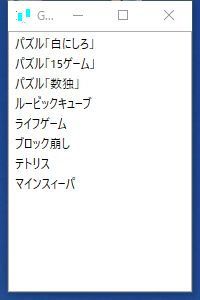
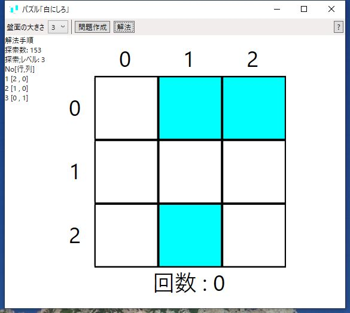
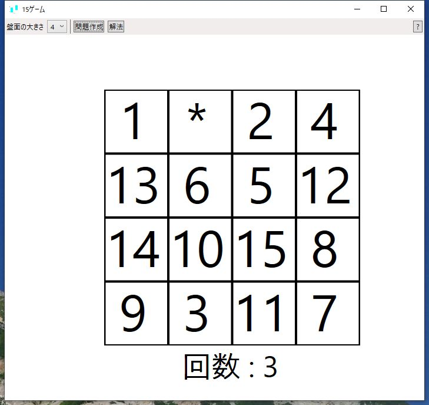
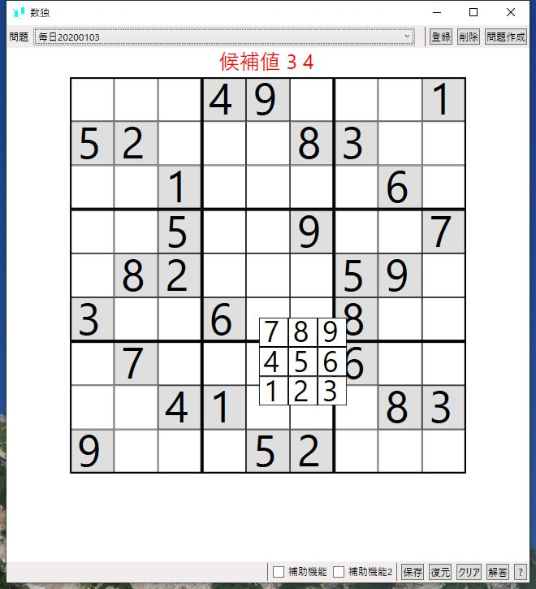
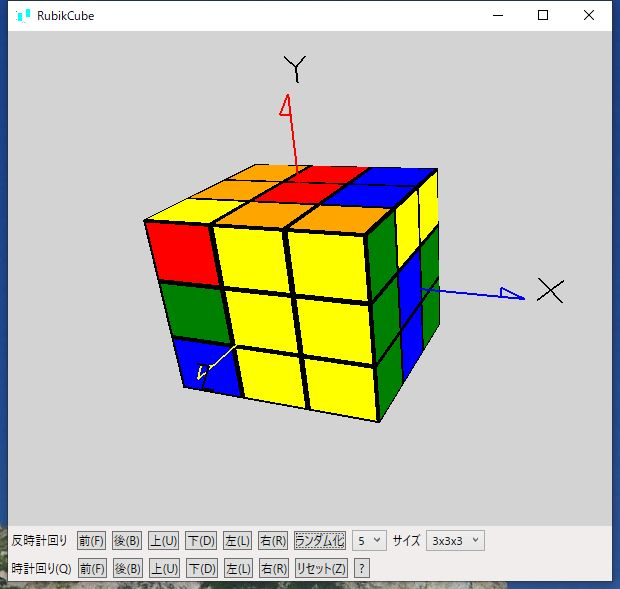
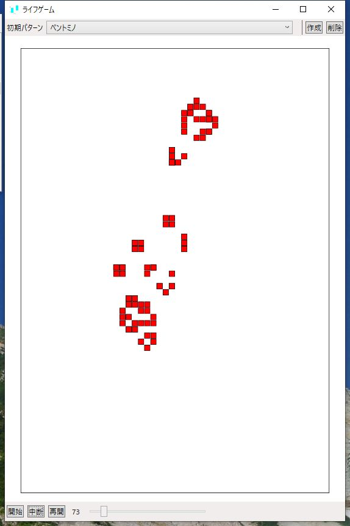
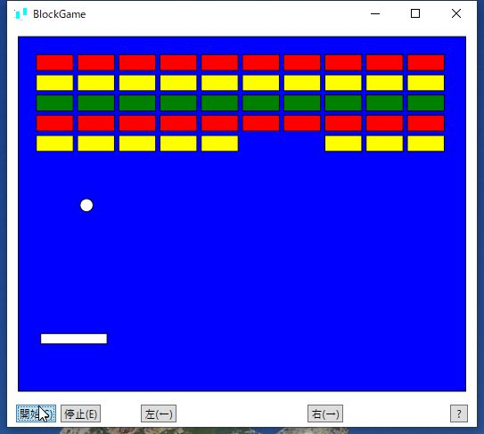
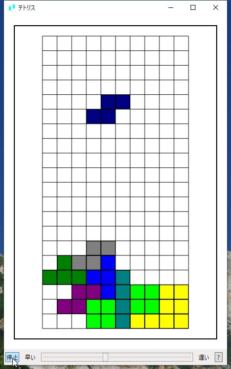

# GameApp

### シンプルなゲームの寄せ集め

非常にシンプルなゲームを作ってみました。  

実行方法は[GameApp.zip](GameApp.zip)をダウンロードし適当なフォルダーに展開してGameApp.exeを実行する。  
  

1) 起動画面(ゲームを選択)  
  
2) 白にしろ  
  第一学習社のホームページに載っていたパズルを模したもの。
 [問題作成]ボタンを押すとマスの一部が反転する。そこでマスの一つをクリックするとそのマスと上下左右のマスが反転するのでそれを繰り返してすべてを白にする。  
  
3) 15ゲーム  
　スライディンクブロックパズルというのが正式名称のようです。
正方形のマスの中に数字が記入されたブロックが乱雑に入っているものをスペースを利用して
ブロックをスライドさせながら移動し数字の順にブロックを並べなおします。
盤の大きさが ３ｘ３のものを８パズル、４ｘ４のものを１５パズルといいます。  
  
4) 数独  
数独（すうどく）は、3×3のブロックに区切られた 9×9の正方形の枠内に1〜9までの数字を入れるペンシルパズルの一つ。  
問題を解くための補助機能も追加してみた。  
  
5) ルービックキューブ  
ルービックキューブのシミュレーションでボタンかキー入力で回転操作をさせます。3x3x3 で難しい時は 2x2x2 で試してみてください。  
  
6) ライフゲーム  
生命の誕生、進化、淘汰などのプロセスを簡易的なモデルで再現したシミュレーションゲーム。初期の形状によってその後の状態が変わる。初期形状をうまく作成すると生存期間を長くし、繁殖させることができる。  
  
7) ブロック崩し  
ボタンでも操作できますが、矢印キーでパドルを左右に移動します。また S keyで開始、E keyで終了、P Keyで一時停止します。
  
8) テトリス  
キー操作で落下するブロックを操作します。S keyで開始と停止、ESC keyで終了、左右矢印キーで左右に移動、R keyで右回転、M keyで縦軸で反転、PgUp keyで落下速度を上げる、PgDn keyで測度を落とす。  
  
9) マインスイーパー  
マウスの左クリックでブロックを開く、右クリックで旗を立てる。
  

### ■実行環境
GameApp.zipをダウンロードして適当なフォルダに展開し、フォルダ内の GameApp.exe をダブルクリックして実行します。  

### ■開発環境  
開発ソフト : Microsoft Visual Studio 2022  
開発言語　 : C# 7.3 Windows アプリケーション  
フレームワーク　 : .NET framework 4.7.2  
NuGetライブラリ : OpenTK(3.3.2),OpenTK.GLControl(3.1.0)  
自作ライブラリ  : WpfLib, Wpf3DLib